11. STATIC ROUTING : PART 2
---

REVIEW:

SWITCHES forward traffic WITHIN LAN's ROUTERS forward traffic BETWEEN LAN's

WAN (Wide Area Network)

Network spread over a large area

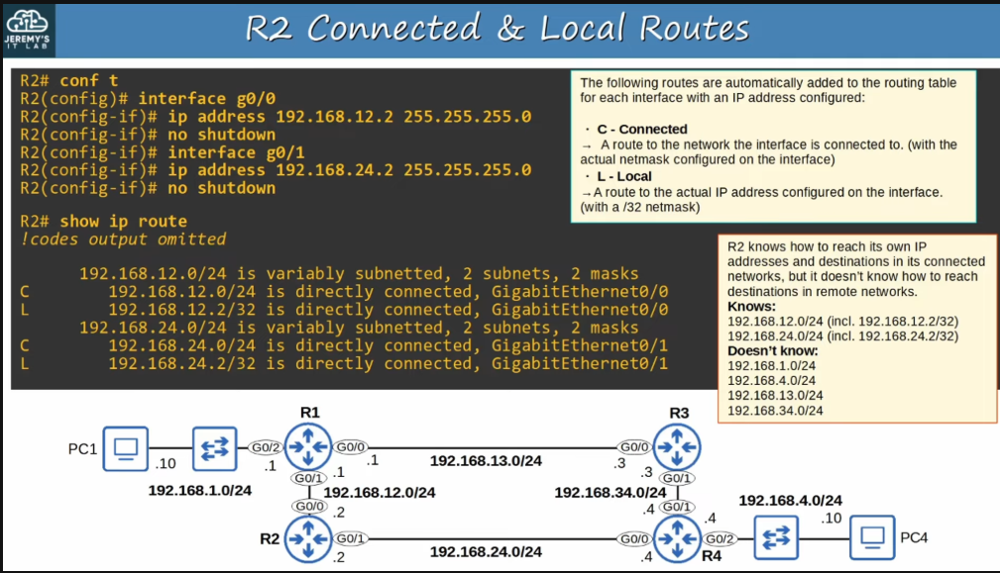

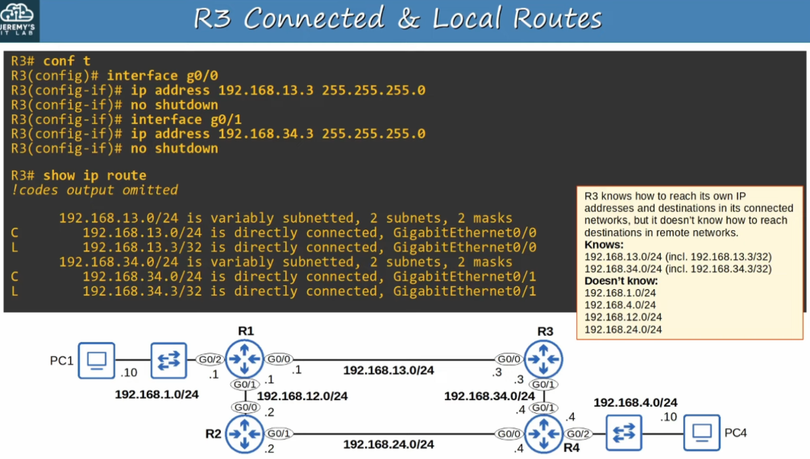

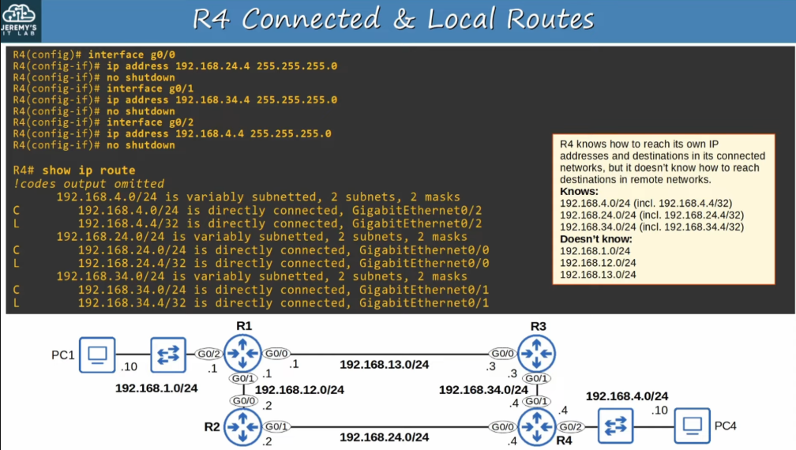

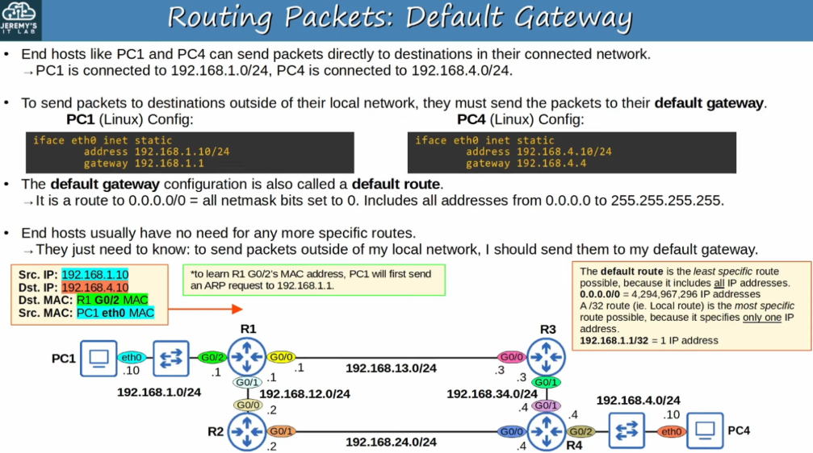

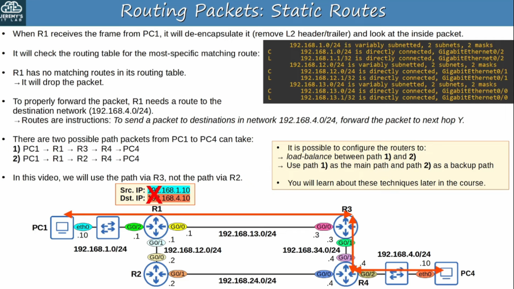

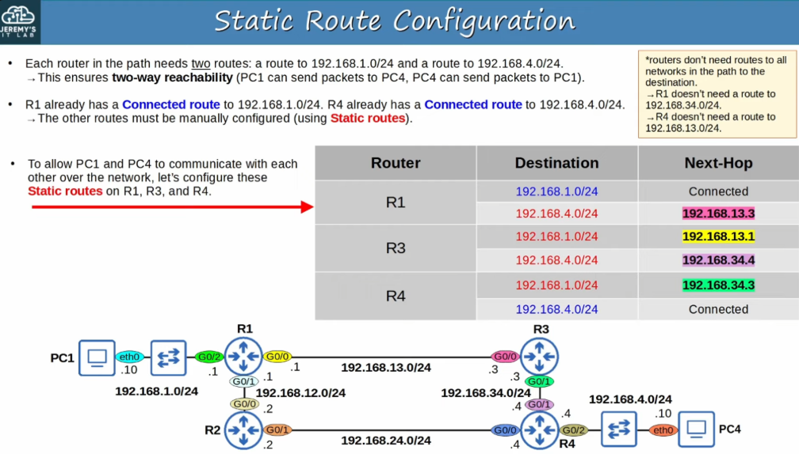

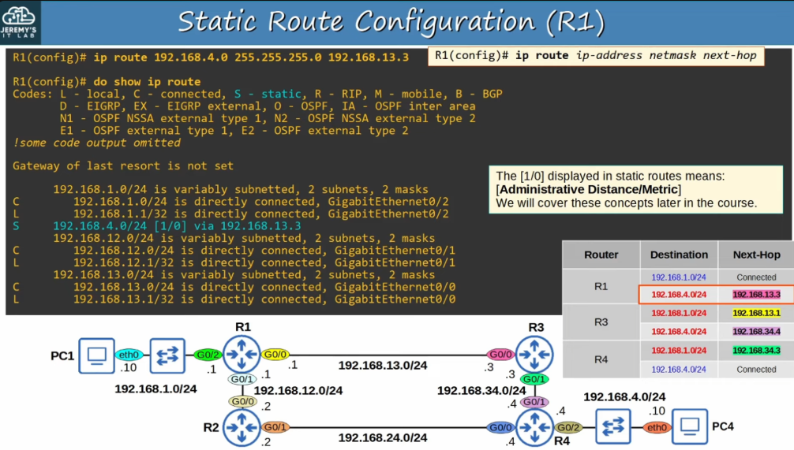

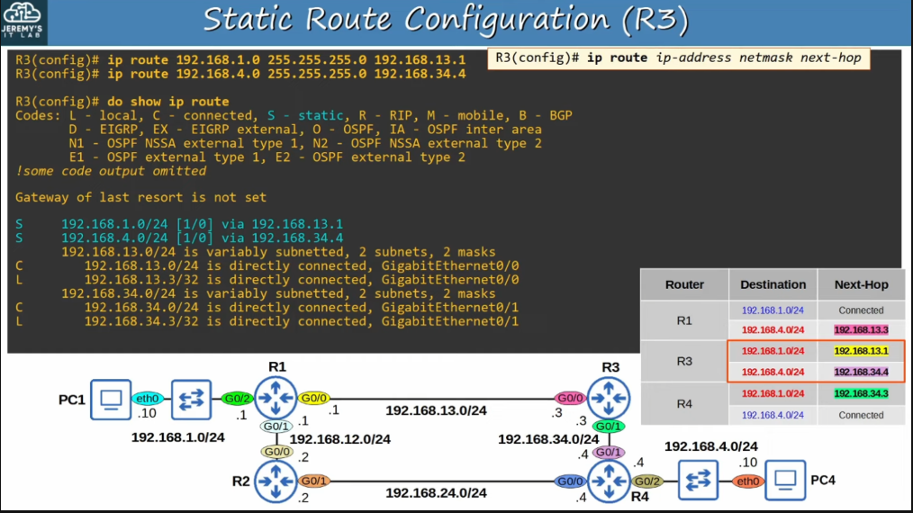

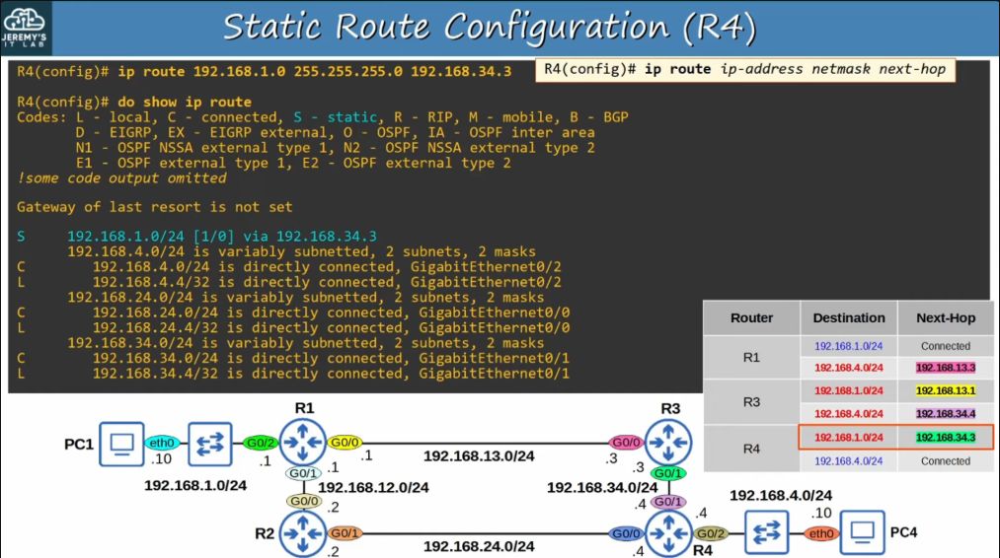

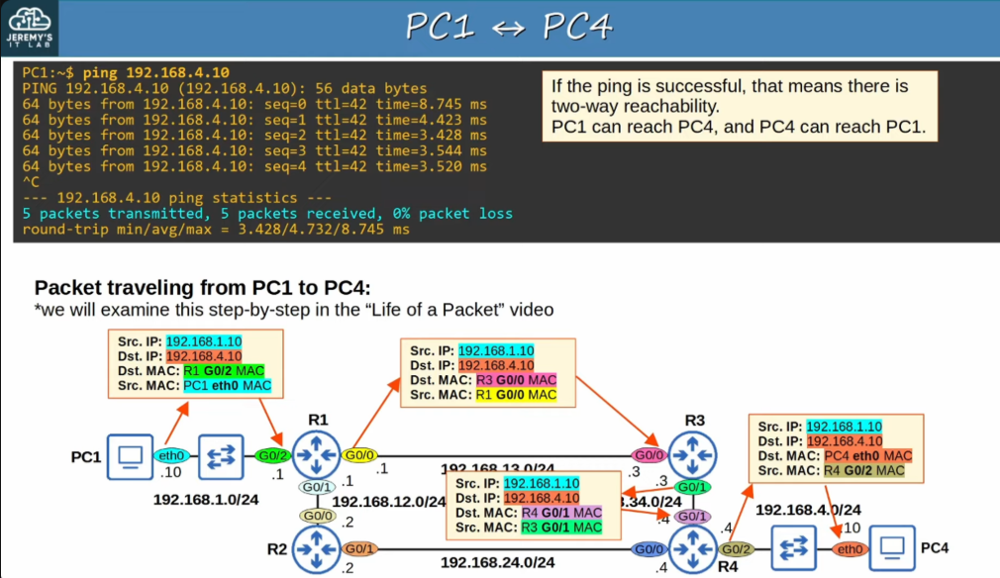

---
Static route

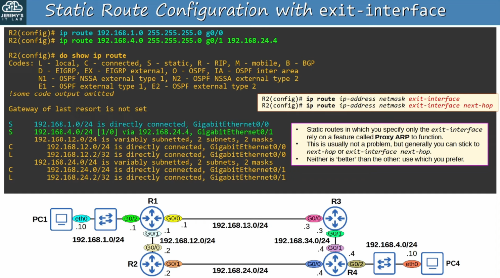

---
Defual Route
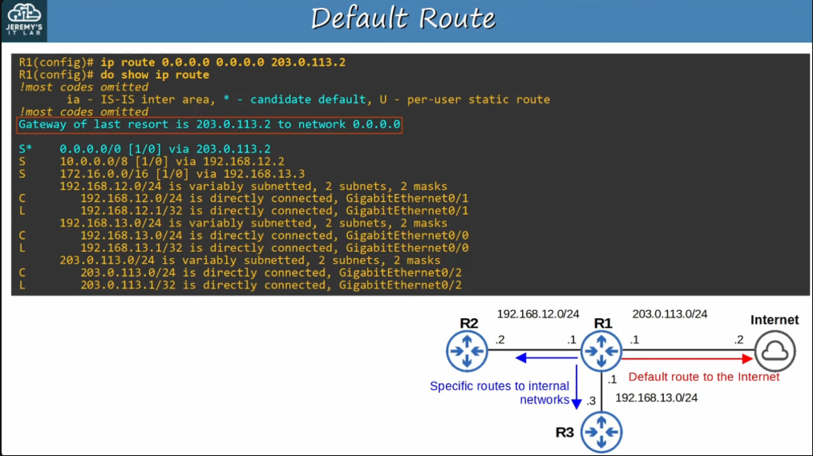