12. Life OF A PACKET
---

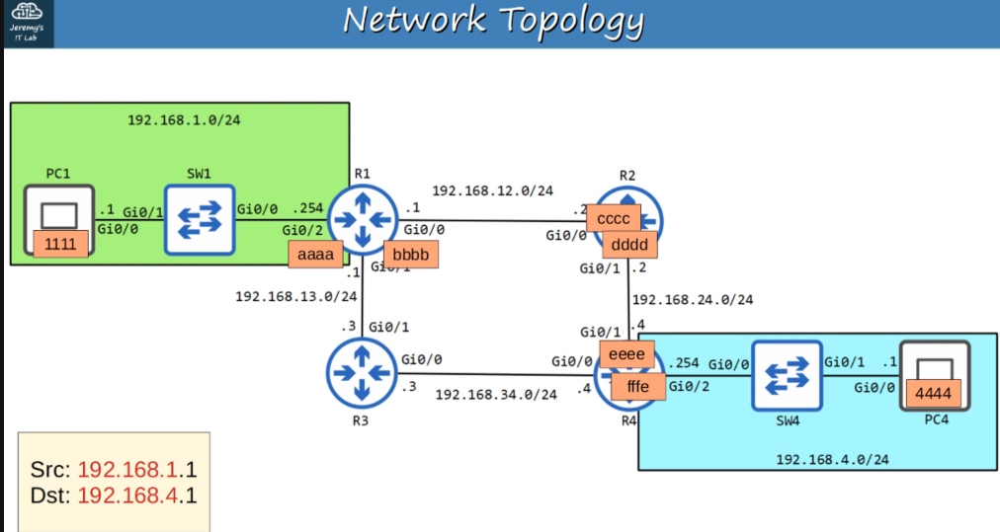

EACH Network device's interfaces have a UNIQUE MAC Addresses.

In a TCP HEADER

SOURCE IP ADDRESS comes before DESTINATION IP ADDRESS

while...

in an ETHERNET HEADER

DESTINATION MAC ADDRESS comes before SOURCE MAC ADDRESS

---

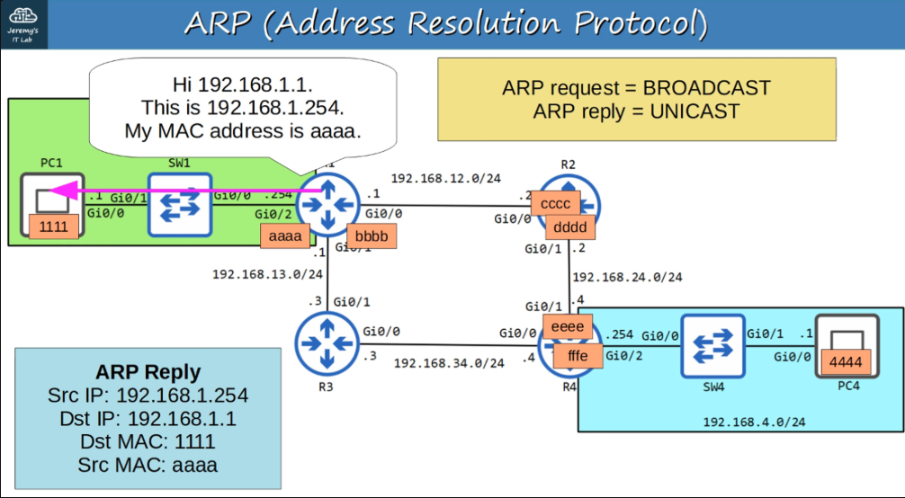

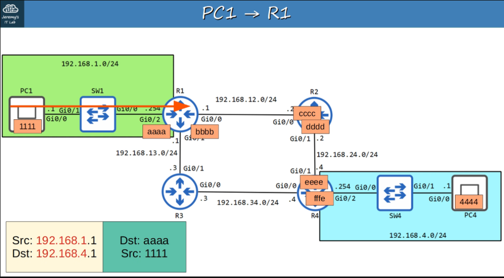

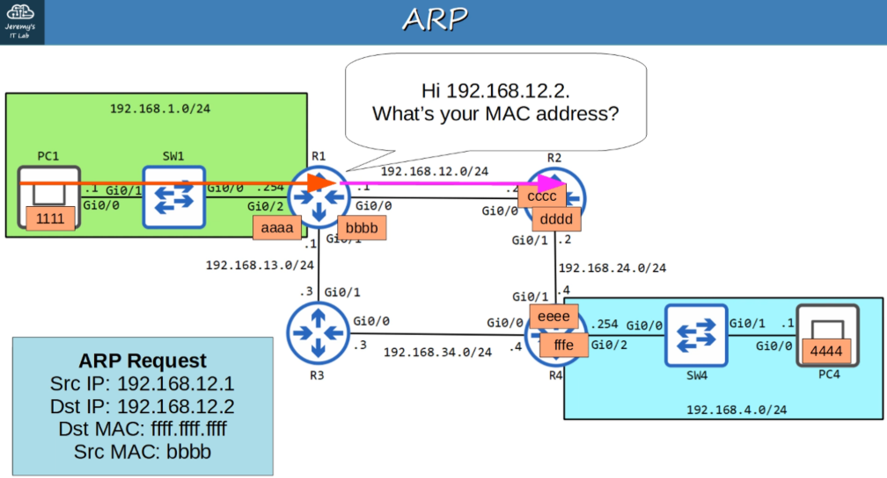

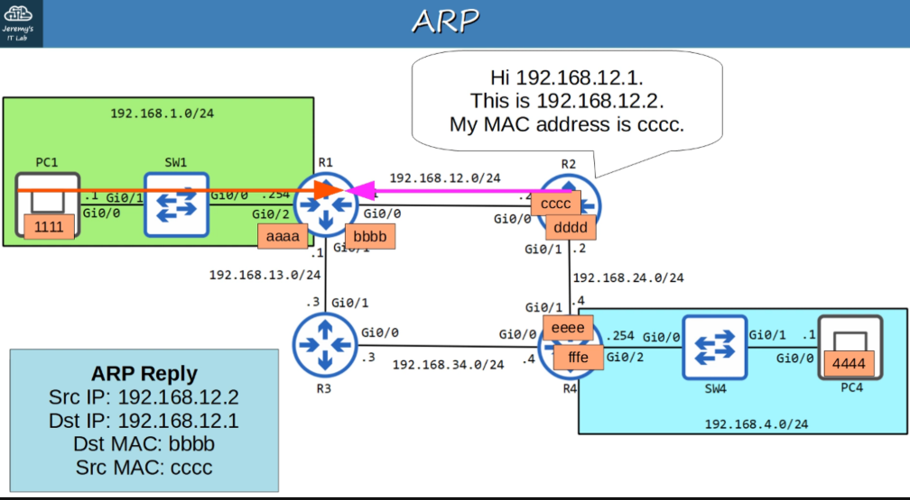

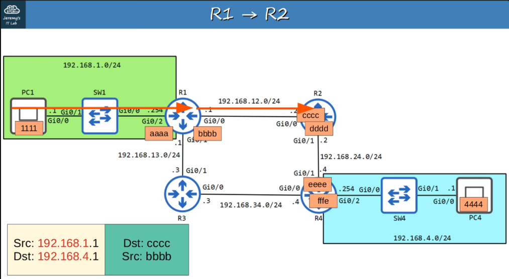

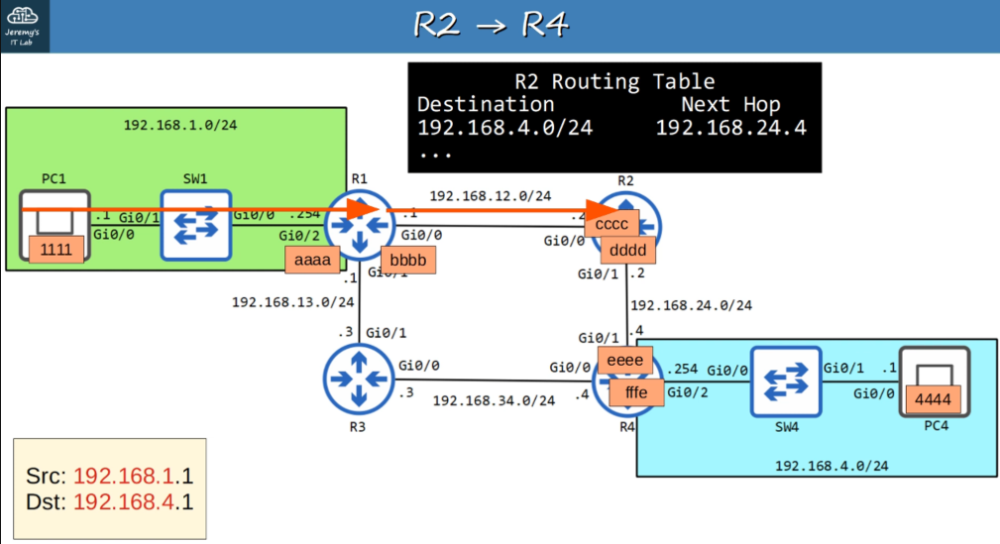

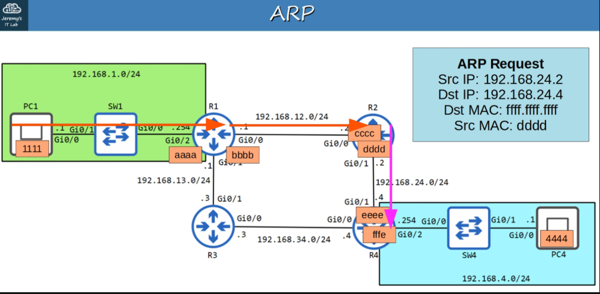

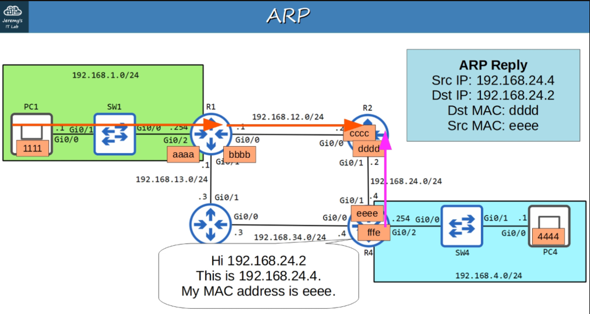

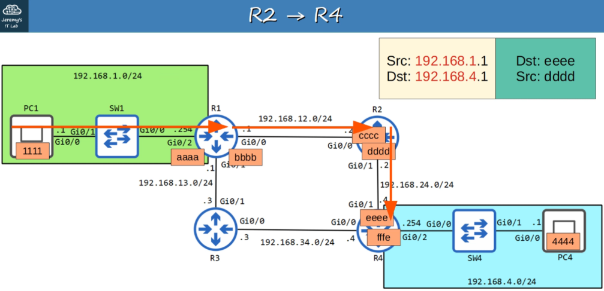

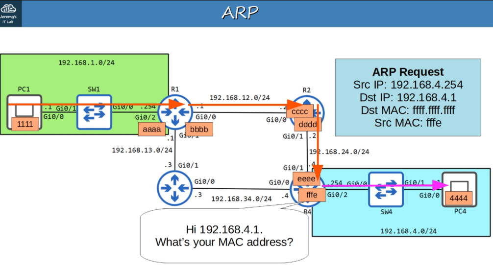

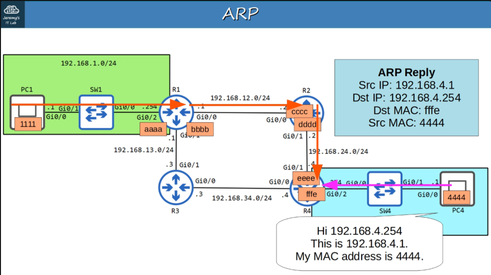

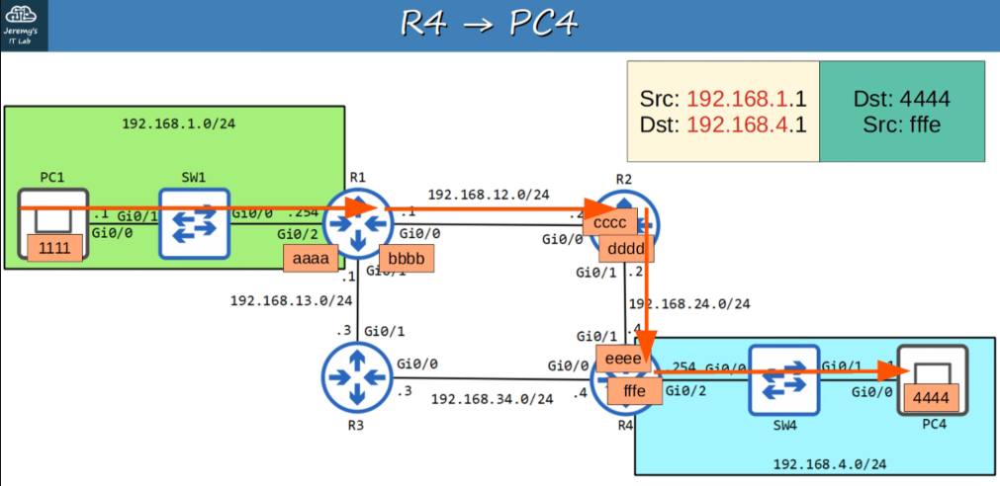

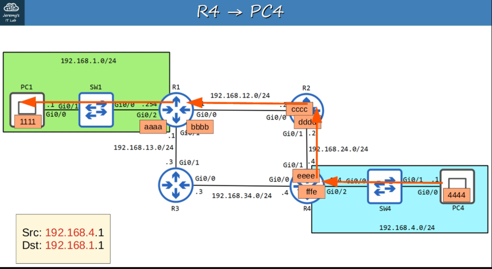

When a HOST sends a packet to another HOST, the SOURCE or DESTINATION IP doesn't change - even though ROUTERS may change the ETHERNET HEADER (SRC/DEST MAC ADDRESSES).