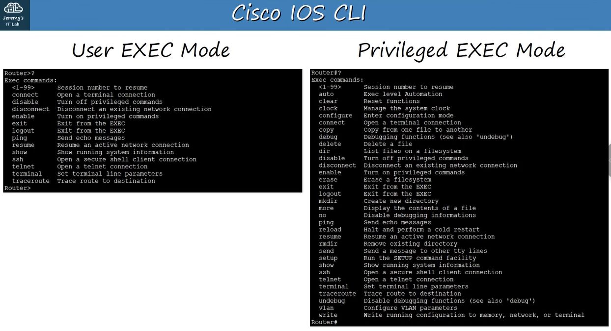
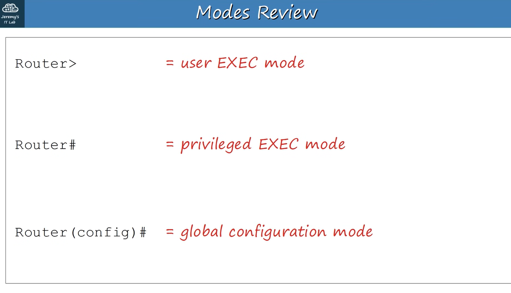
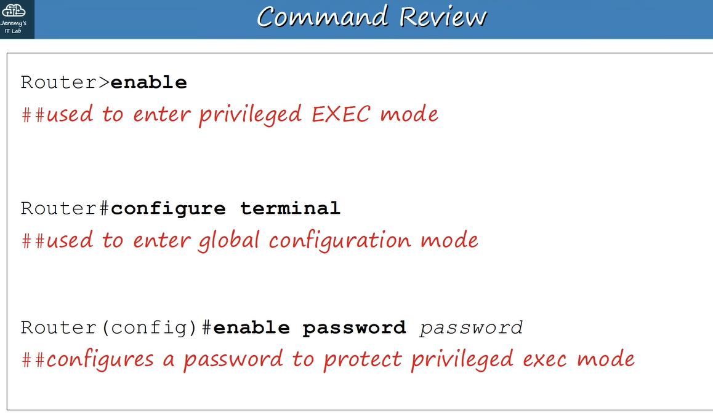
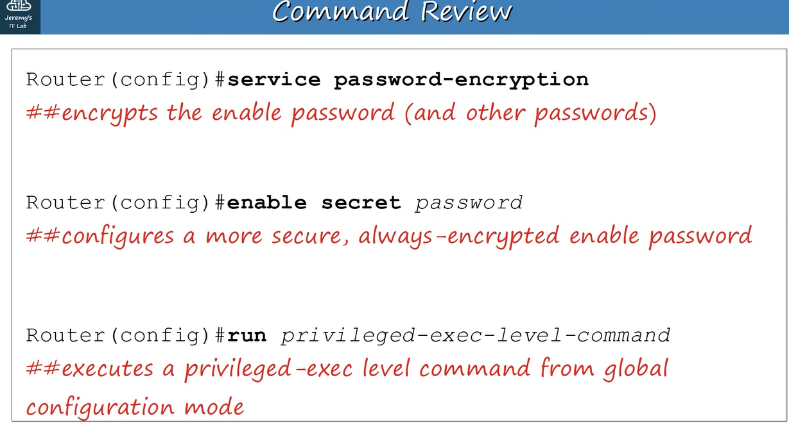
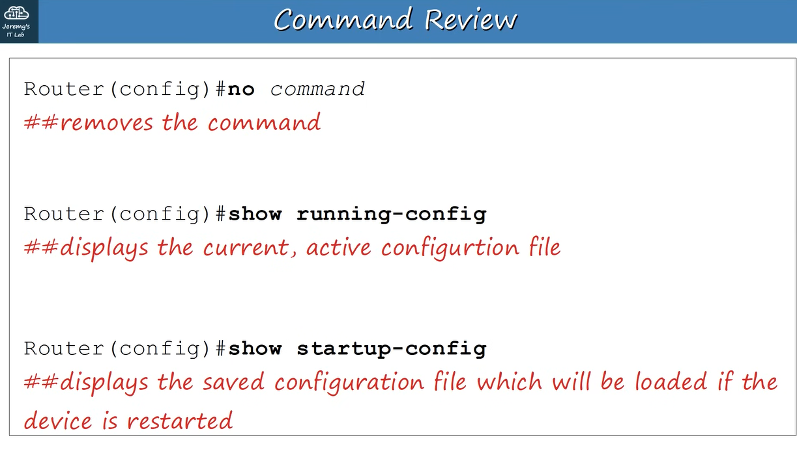
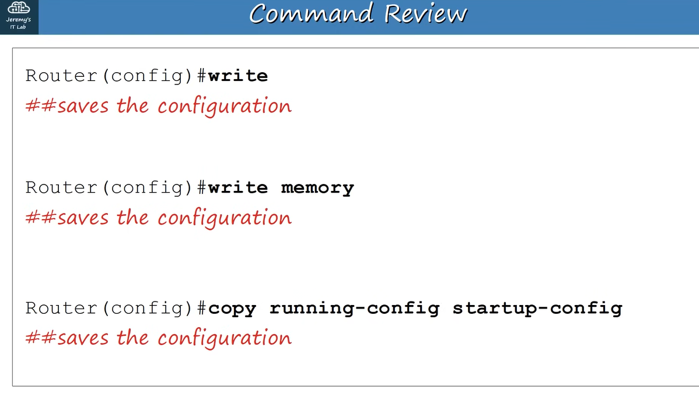

## 4. Introduce to the CLI

## What IS CLI?

- A "Command-line Interface"
- The interface you use to configure Cisco devices
A GUI is a "Graphical User Interface"

## How do you connect to a Cisco Device?

- Console Port : When you first configure a device, you have to connect via the Console Port.

## Cisco Default Settings are:

Speed (baud) : 9600 bits/second Data bits: 8 data bits Stop bits: 1 stop bit (sent after 8 data bits are sent) Parity: None Flow Control: None

---

## When you first enter the CLI you will DEFAULT be in what is called 'User EXEC' mode.

USER EXEC MODE:

(Hostname) > // Prompt looks like THIS //

- User EXEC mode is very limited.
- User can look at some things but can't make ANY changes to the configuration.
- AKA 'User Mode'
Using the 'enable' command, in User EXEC mode, switches you to 'Privileged EXEC' mode.

---

## PRIVILEGED EXEC MODE:

- Provides complete access to view the device's configuration, restart the device, etc.
- Cannot change the configuration, but can change the time on the device, save the configuration file, etc.
(Hostname)# // Prompt looks like THIS //

---

## USE a Question Mark (?) to view the available commands in ANY mode. Combining ? with a letter or partial command will list all the commands with those letters.\

USE the TAB key to complete partially entered commands IF the command exists.

---

## GLOBAL CONFIGURATION MODE:

To enter Global Configuration Mode, enter the command, within Privileged EXEC mode

- 'configure terminal' (or 'conf t')

- Router# configure terminal Router(config) #

- Router(config) # 

Type 'exit' to drop back into 'Privileged EXEC' mode.

---

## There are TWO separate configuration files kept on the device at once.

Running-config :

- The current, ACTIVE configuration file on the device. As you enter commands in the CLI, you edit the active configuration.

Startup-config :

- The configuration file that will be loaded upon RESTART of the device.
To see the configuration files, inside 'Privileged EXEC' mode:

Router# show running-config // for running config //

OR

Router# show startup-config // for startup config //

---

## To SAVE the Running configuration file, you can:

Router# write Building configuration... [OK]

Router# write memory Building configuration... [OK]

Router# copy running-config startup-config

Destination filename [startup-config]?

Building configuration... [OK]

---

## To Enable Password for User EXEC mode:

Router(config)# enable password (password)

Passwords ARE case-sensitive.
// This command encrypts plain-text passwords, visible in the config files, using simple encryption.

Router(config)# service password-encryption

If you enable 'service password-encryption'

- Current passwords WILL be encrypted.
- Future passwords WILL be encrypted.
- The 'enable secret' WILL NOT be effected.

If you disable 'service password-encryption'

- Current passwords WILL NOT be decrypted.
- Future passwords WILL NOT be encrypted.
- The 'enable secret' WILL NOT be effected.

// This command enables passwords for the Privileged EXEC mode.

Router(config)# enable secret (password)

// enable secret will ALWAYS be encrypted (at level 5)

---

## How To SAVE the Running configuration file, you can:

- Router# write Building configuration... [OK]

- Router# write memory Building configuration... [OK]

- Router# copy running-config startup-config

- Destination filename [startup-config]?

- Building configuration... [OK ] 

---
## The image explains the end-of-line symbol

