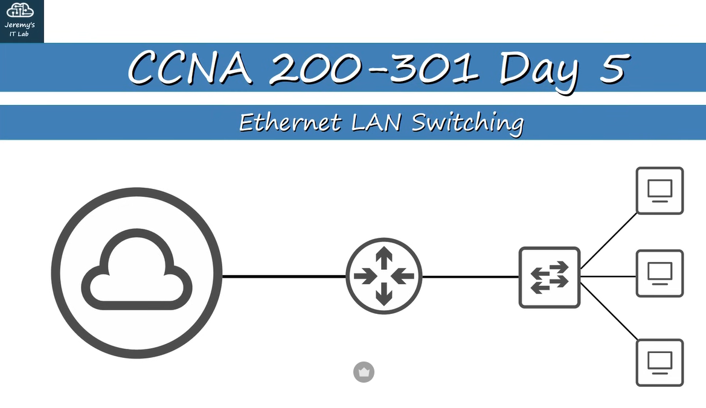
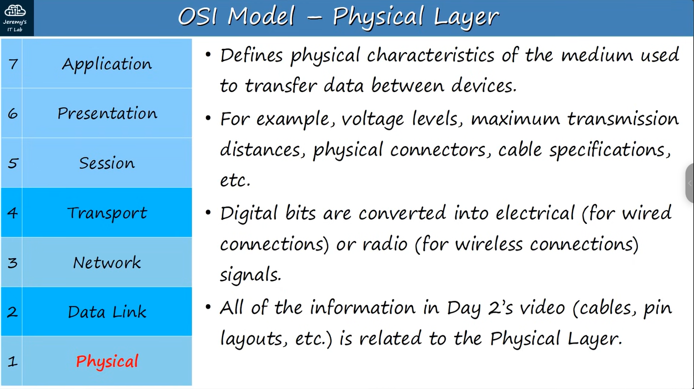
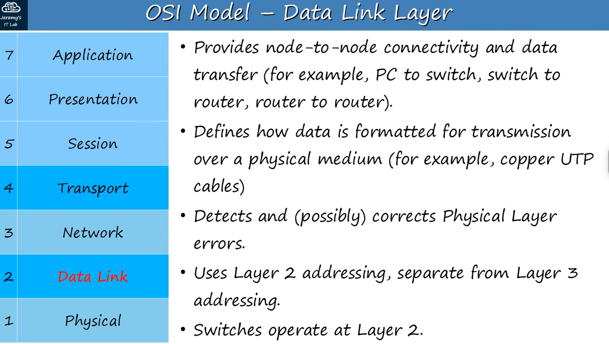
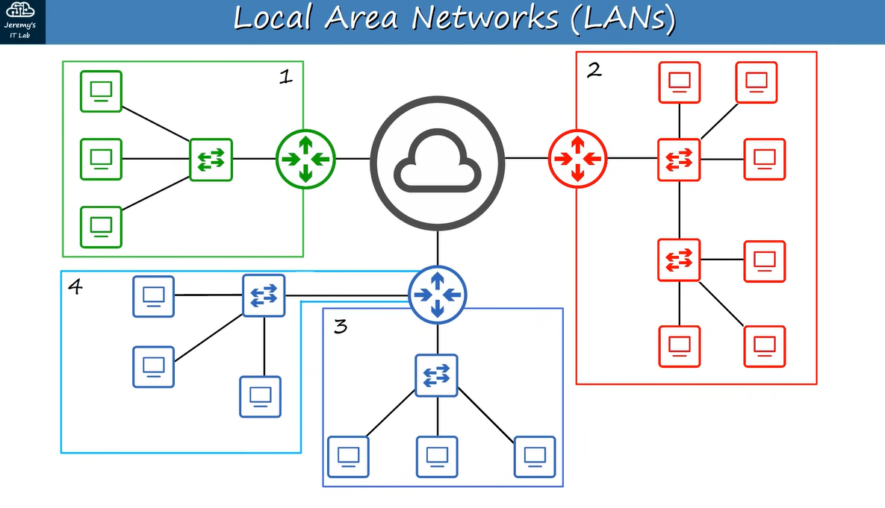
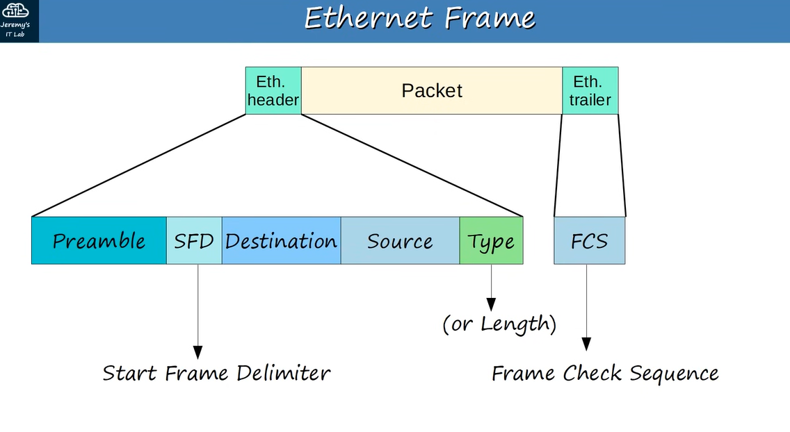
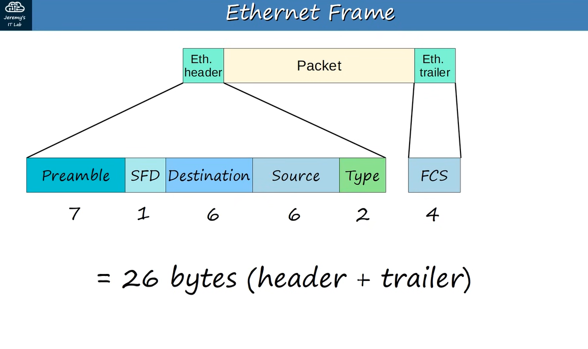
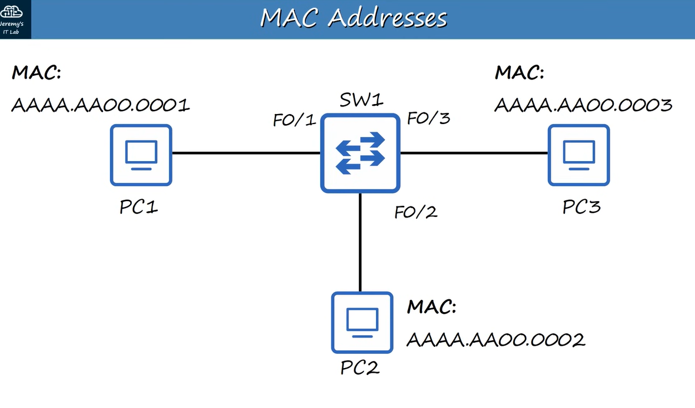
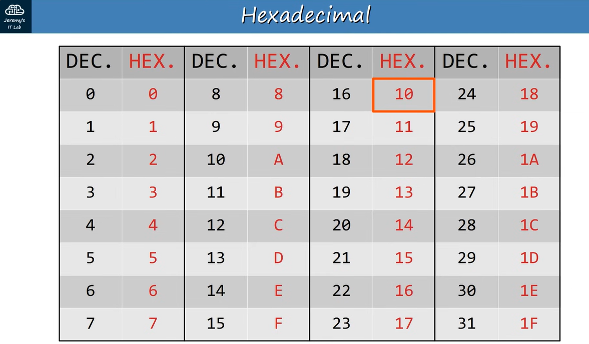
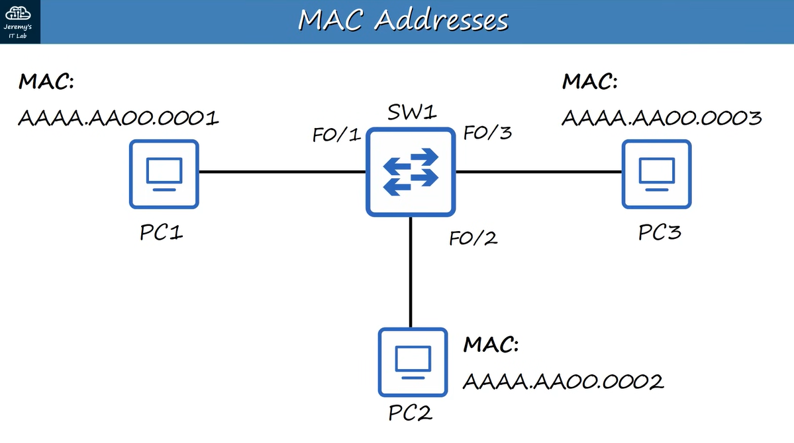
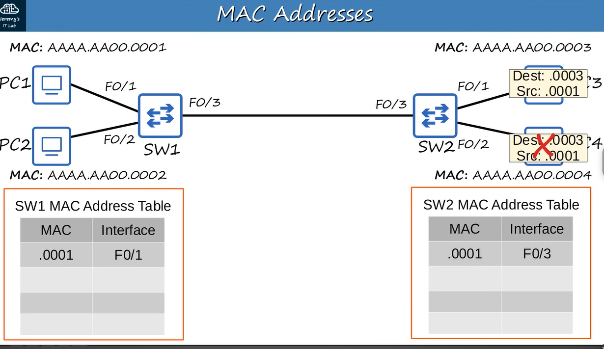

## ETHERNET LAN SWITCHING : PART 1

## LAN's

- A LAN is a network contained in a relatively small area.
- Routers are used to connect separate LAN's

An ETHERNET FRAME looks like:

Ethernet Trailer --- PACKET --- Ethernet Header

The Ethernet Header contains 5 Fields:

Preamble -- SFD -- Destination -- Source -- Type 7 bytes -- 1 byte -- 6 bytes -- 6 bytes -- 2 bytesW

---

## PREAMBLE:

- Length: 7 bytes (56 bits)
- Alternating 1's and 0's
- 10101010 * 7x
- Allows devices to synchronize their receiver clocks

## SFD : ‘Start Frame Delimiter’

Length: 1 byte(8 bits)
10101011
Marks end of the PREAMBLE and beginning of rest of frame.

---

## DESTINATION AND SOURCE

- Layer 2 Address
- Indicates the devices sending / receiving the frame
- MAC = ’Media Access Control’
- = 6 byte (48-bit) address of the physical device

---

## TYPE / LENGTH

- 2 bytes (16-bit) field
- A value of 1500 or less in this field indicates the LENGTH of the encapsulated packet (in bytes)
- A value of 1536 or greater in this field indicates the TYPE of the encapsulated packet and length is determined via other methods.
- IPv4 = 0x0800 (hexadecimal) = 2048 in decimal
- IPv6 = 0x86DD (hexadecimal) = 34525 in decimal
- Layer 3 protocol used in the encapsulated Packet, which is almost always Internet Protocol (IP) version 4 or version 6.

---

## The ETHERNET TRAILER contains:

FCS

-  ‘FRAME CHECK SEQUENCE’
- 4 bytes (32 bits) in length
- Detects corrupted data by running a 'CRC' algorithm over the received data
- CRC = "Cyclic Redundancy Check"

---

## Altogether the ETHERNET FRAME = 26 bytes (header + trailer)

---

## MAC ADDRESS (48 bits long)

- 6-bytes (48-bits) physical address assigned to the device when it is made.
- AKA 'Burned-In Address' (BIA)
- Is globally unique
- First 3 bytes are the OUI (Organizationally Unique Identifier) which is assigned to the company making the device
- The last 3 bytes are unique to the device itself
- Written as 12 hexadecimal characters

Example:

E8:BA:70 // 11:28:74 OUI // Unique Device ID

INTERFACE NAMES

F0/1, F0/2, F0/3... F stands for "Fast Ethernet" or 100 Mbps interfaces.

---

MAC ADDRESS TABLE
Each switch stores A DYNAMICALLY learned Mac Address table, using the source Mac Address of frame it receives

When Switch doesn't know the DESTINATION MAC ADDRESS of frame (Unkown Unitcat Frame ),it is forced to Flood the Frame Forward the frame out of ALL it's interface, expect  the one received the packet from

When a know Unicat Frame is Know( Mac Address is recorgnized by the Entry in the Mac address table ), the frame FORWARDED like normal

- Note: Dynamic MAC Addresses are removed from the MAC ADDRESS TABLE every 5 minutes of inactivity.